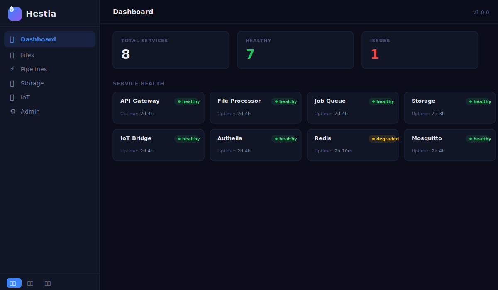
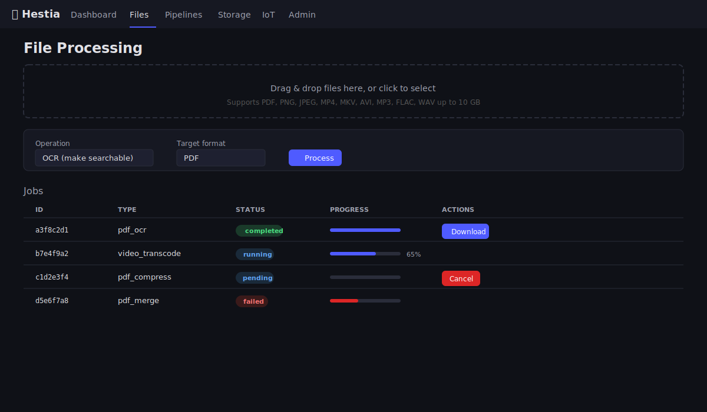
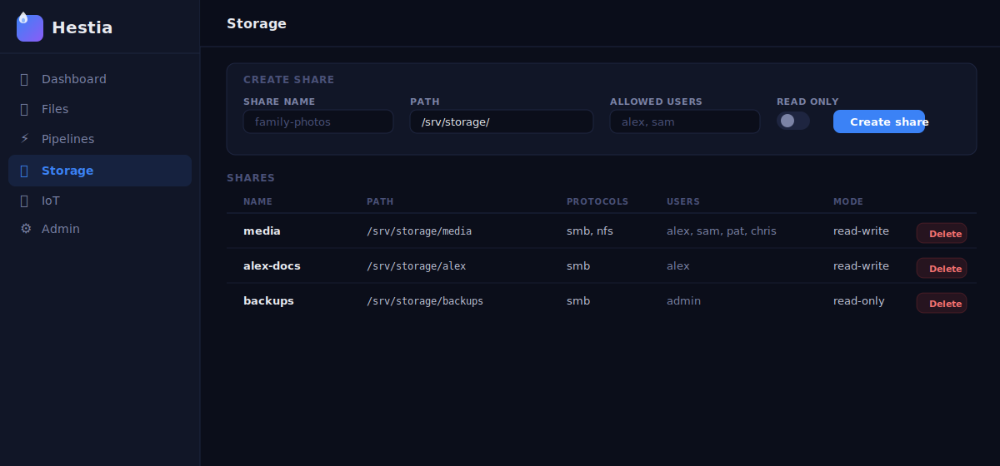
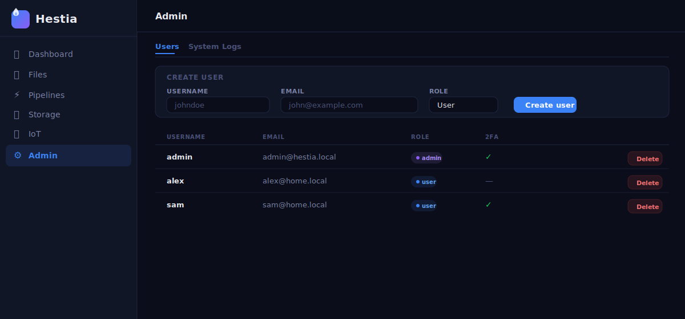

# Hestia

[](https://github.com/mrtrkmn/hestia/actions/workflows/tests.yml)
[](https://www.python.org/downloads/)
[](LICENSE)

*Adını Yunan ocak tanrıçası Hestia'dan alır — her evin merkezindeki kutsal ateş, tüm işlevlerin etrafında toplandığı nokta.*

Dosya işleme, ağa bağlı depolama, güvenli ağ erişimi, IoT entegrasyonu ve iş kuyruğunu tek bir web panelinde birleştiren, tamamen yerel çalışan, kendi sunucunuzda barındırılan bir platform. Sıfır bulut bağımlılığı — her şey tek bir Linux makinesinde çalışır.

## Mimari

```
Tarayıcı/İstemci ──HTTPS──▶ Caddy (Ters Proxy, TLS)
                                  │
                  ┌───────────────┼───────────────┐
                  ▼               ▼               ▼
              Panel          API Gateway      Authelia (SSO)
              (React SPA)    (FastAPI)        (OIDC, 2FA)
                                  │
                  ┌───────────────┼───────────────┐
                  ▼               ▼               ▼
          Dosya İşleyici   Depolama Servisi   IoT Köprüsü
          (PDF/Görsel/AV)  (Samba/NFS/ZFS)    (HA + MQTT)
                  │
          İş Kuyruğu + İşçiler (Redis)

Uzak İstemci ──WireGuard──▶ VPN Geçidi (port 51820)
```

Tüm servisler localhost üzerinden iletişim kurar. Redis asenkron iş dağıtımını yönetir. Caddy, otomatik oluşturulan kendinden imzalı sertifikalarla TLS sonlandırması yapar.

## Ekran Görüntüleri


*Durum rozetleri ve çalışma süresi takibi ile servis sağlık izleme*


*Dosya yükleme, işlem seçimi ve ilerleme çubuklarıyla iş takibi*


*Kullanıcı bazlı erişim kontrolü ile NAS paylaşım yönetimi*


*Roller ve 2FA durumu ile kullanıcı yönetimi*

## Proje Yapısı

```
hestia/
├── api-gateway/          # FastAPI — merkezi API yönlendirme, JWT kimlik doğrulama, hız sınırlama
├── file-processor/       # PDF birleştir/böl/OCR/sıkıştır, görsel dönüştürme, AV dönüştürme
├── storage-service/      # Samba/NFS paylaşım yönetimi, ZFS anlık görüntüler, opsiyonel Nextcloud
├── iot-bridge/           # Home Assistant + Mosquitto MQTT, otomasyon iş akışları
├── job-queue/            # Redis destekli kuyruk, işçi süreçleri, iş REST API
├── dashboard/            # React + TypeScript + Vite SPA
├── shared/               # Pydantic modeller, yapılandırma, kimlik doğrulama (JWT/TOTP/RBAC)
├── config/               # Caddy, Authelia, WireGuard, Mosquitto yapılandırmaları
└── deploy/
    ├── native/           # systemd birimleri, kurulum betiği, güvenlik duvarı kuralları
    └── docker/           # docker-compose.yml, .env.example
```

## Gereksinimler

### Yerel Mod (varsayılan)

- Linux (Ubuntu 22.04+ / Debian 12+ önerilir)
- Python 3.12+
- Node.js 18+ (panel derlemesi için)
- Redis 7+
- FFmpeg (video/ses dönüştürme için)
- Tesseract + ocrmypdf (PDF OCR için)
- Samba (SMB paylaşımları için)
- WireGuard (VPN için)
- Caddy 2+ (ters proxy için)

### Docker Modu (alternatif)

- Docker Engine 24+
- Docker Compose v2

## Hızlı Başlangıç — Yerel Mod

```bash
git clone <repo-url> /opt/hestia
cd /opt/hestia
sudo bash deploy/native/install.sh
```

Kurulum betiği şunları yapar:

1. Her servis için ayrı root olmayan sistem kullanıcıları oluşturur
2. Python sanal ortamı kurar ve tüm bağımlılıkları yükler
3. Kriptografik olarak rastgele gizli anahtarlar üretir (256-bit entropi)
4. Yapılandırma dosyalarını `/etc/hestia/` dizinine dağıtır
5. systemd birimlerini kurar ve etkinleştirir
6. Güvenlik duvarı kurallarını uygular (yalnızca 80, 443, 51820 portları açık)
7. Tüm servisleri başlatır

Hub 120 saniye içinde sağlıklı duruma geçmelidir. `https://localhost` adresinden erişin.

## Hızlı Başlangıç — Docker Modu

```bash
cd deploy/docker
cp .env.example .env
# .env dosyasını ayarlarınıza göre düzenleyin
docker compose up -d
```

Tüm servisler bağımlılık sırasına göre sağlık kontrolleriyle başlar. Veriler Docker volume'larında kalıcı olarak saklanır.

## Geliştirme Ortamı

### Backend (Python)

```bash
python3 -m venv .venv
source .venv/bin/activate
pip install -r shared/requirements.txt
pip install -r job-queue/requirements.txt
pip install -r file-processor/requirements.txt
pip install fastapi uvicorn httpx python-multipart
pip install fakeredis pytest pytest-asyncio hypothesis
```

### Panel (TypeScript)

```bash
cd dashboard
npm install
npm run dev   # Vite geliştirme sunucusunu :5173 portunda başlatır
```

### Servisleri Tek Tek Çalıştırma

```bash
# API Gateway
cd api-gateway && uvicorn app.main:app --port 8000

# Dosya İşleyici
cd file-processor && uvicorn app.main:app --port 8001

# İş Kuyruğu API
cd job-queue && uvicorn app.main:app --port 8004

# İşçi
cd job-queue && python -m app.worker
```

## Testleri Çalıştırma

Test paketi, Hypothesis (Python) ve fast-check (TypeScript) kullanarak 30 doğruluk özelliğini kapsayan 126 test içerir.

```bash
# Shared + İş Kuyruğu (proje kök dizininden)
python -m pytest shared/ job-queue/ -v

# API Gateway
cd api-gateway && python -m pytest tests/ -v

# Dosya İşleyici
cd file-processor && python -m pytest tests/ -v

# Depolama Servisi
cd storage-service && python -m pytest tests/ -v

# IoT Köprüsü
cd iot-bridge && python -m pytest tests/ -v

# Panel
cd dashboard && npm test
```

## Servisler

### API Gateway (port 8000)

Merkezi HTTP giriş noktası. Tüm uç noktalar `/api/v1/` altında versiyonlanmıştır.

- JWT kimlik doğrulama — eksik/geçersiz/süresi dolmuş token'lar için 401
- Girdi temizleme — SQL enjeksiyonu, XSS, dizin geçişi tespiti
- Hız sınırlama — kullanıcı başına dakikada 100 istek (yapılandırılabilir)
- `/api/docs` adresinde OpenAPI 3.0 şartnamesi

### Dosya İşleyici (port 8001)

- **PDF**: birleştirme, bölme, OCR (Tesseract), sıkıştırma (pikepdf)
- **Görsel**: PDF↔PNG↔JPEG dönüştürme, format doğrulama
- **Medya**: video (MP4/MKV/AVI/WebM) ve ses (MP3/FLAC/WAV/AAC/OGG) dönüştürme (FFmpeg)
- Bozuk/desteklenmeyen dosyalar, dosya adı ve hata nedeni içeren yapılandırılmış hatalar döndürür

### Toplu İş Hattı Motoru

Birden fazla dosya işlemini zincirleme (ör. OCR → sıkıştır → PNG'ye dönüştür):

- Yürütmeden önce adımlar arası format uyumluluğunu doğrular
- Sıralı yürütme, çıktıyı bir sonraki adıma aktarır
- Hata durumunda tamamlanan çıktıları korur
- Adlandırılmış iş hattı tanımları diske kaydedilir/yüklenir

### İş Kuyruğu (port 8004) + İşçiler

- Öncelik seviyeli (düşük, normal, yüksek) Redis destekli FIFO kuyruğu
- 1 saniye içinde benzersiz iş kimliği döndürülür
- İşçiler her ≤5 saniyede ilerleme bildirir
- Çökme tespiti (30 sn kalp atışı) ve otomatik yeniden deneme (3 kereye kadar)
- İş meta verileri 7 gün saklanır

### Depolama Servisi (port 8002)

- Windows/macOS/Linux için Samba (SMB) paylaşımları
- Linux/macOS için opsiyonel NFS dışa aktarımları
- Sağlama toplamı, sıkıştırma ve anlık görüntülerle opsiyonel ZFS veri kümeleri
- Kullanıcı ve paylaşım bazlı erişim kontrolü (yönetici tümünü atlar)
- WebDAV ve dosya senkronizasyonu için opsiyonel Nextcloud entegrasyonu

### IoT Köprüsü (port 8003)

- Home Assistant örnek yönetimi
- Kimlik doğrulamalı bağlantılarla Mosquitto MQTT aracısı
- MQTT konu kalıpları veya cron zamanlamaları ile tetiklenen otomasyon iş akışları
- Başarısız eylemleri üstel geri çekilme ile 3 kez yeniden dene
- Tam yürütme günlüğü (zaman damgası, tetikleyici, eylemler, durum)

### Kimlik Doğrulama Servisi (Authelia, port 9091)

- Tüm servisler genelinde OpenID Connect ile SSO
- TOTP iki faktörlü kimlik doğrulama (kullanıcı bazlı isteğe bağlı)
- Yapılandırılabilir süre ile JWT token'ları (varsayılan 1 saat)
- Parola politikası: en az 12 karakter, büyük + küçük harf + rakam + özel karakter
- Hesap kilitleme: 10 dakikada 5 başarısız deneme → 15 dakika kilit
- `admin` ve `user` rolleriyle RBAC

### Panel (geliştirmede port 5173 / üretimde Caddy üzerinden)

- React Router ile React SPA
- Sürükle-bırak dosya yükleme (react-dropzone), 10 GB'a kadar
- Gerçek zamanlı iş ilerleme takibi
- Her 30 saniyede yenilenen servis sağlık kataloğu
- Kullanıcı/rol yönetimi için yönetim paneli
- Duyarlı düzen: 320px'den 2560px'e

## API Referansı

`/auth/*`, `/api/docs`, `/healthz` dışındaki tüm uç noktalar `Authorization: Bearer <token>` gerektirir.

| Metod | Uç Nokta | Açıklama |
|---|---|---|
| POST | `/api/v1/files/upload` | Dosya yükle |
| POST | `/api/v1/files/process` | İşleme görevi gönder |
| GET | `/api/v1/files/{id}` | Dosya meta verisi |
| GET | `/api/v1/files/{id}/download` | İşlenmiş dosyayı indir |
| GET | `/api/v1/jobs` | İşleri listele (duruma göre filtrelenebilir) |
| GET | `/api/v1/jobs/{id}` | İş durumu ve detayları |
| DELETE | `/api/v1/jobs/{id}` | Bekleyen işi iptal et |
| POST | `/api/v1/pipelines` | İş hattı oluştur ve çalıştır |
| GET | `/api/v1/pipelines` | Kayıtlı iş hatlarını listele |
| GET | `/api/v1/pipelines/{id}` | İş hattı tanımını getir |
| PUT | `/api/v1/pipelines/{id}` | İş hattını güncelle |
| DELETE | `/api/v1/pipelines/{id}` | İş hattını sil |
| GET | `/api/v1/storage/shares` | NAS paylaşımlarını listele |
| POST | `/api/v1/storage/shares` | Paylaşım oluştur |
| PUT | `/api/v1/storage/shares/{id}` | Paylaşımı güncelle |
| DELETE | `/api/v1/storage/shares/{id}` | Paylaşımı sil |
| POST | `/api/v1/storage/snapshots` | ZFS anlık görüntüsü oluştur |
| POST | `/api/v1/storage/snapshots/{id}/restore` | Anlık görüntüyü geri yükle |
| GET | `/api/v1/iot/entities` | Home Assistant varlıklarını listele |
| GET | `/api/v1/iot/entities/{id}` | Varlık durumunu getir |
| GET | `/api/v1/iot/automations` | Otomasyon iş akışlarını listele |
| POST | `/api/v1/iot/automations` | Otomasyon oluştur |
| PUT | `/api/v1/iot/automations/{id}` | Otomasyonu güncelle |
| DELETE | `/api/v1/iot/automations/{id}` | Otomasyonu sil |
| GET | `/api/v1/services/health` | Tüm servis durumları |
| GET | `/api/v1/admin/users` | Kullanıcıları listele (yalnızca yönetici) |
| POST | `/api/v1/admin/users` | Kullanıcı oluştur (yalnızca yönetici) |
| PUT | `/api/v1/admin/users/{id}` | Kullanıcıyı güncelle (yalnızca yönetici) |
| DELETE | `/api/v1/admin/users/{id}` | Kullanıcıyı sil (yalnızca yönetici) |
| GET | `/api/v1/admin/logs` | Sistem günlükleri (yalnızca yönetici) |
| GET | `/api/docs` | OpenAPI 3.0 şartnamesi |
| GET | `/healthz` | Sağlık kontrolü |

### Hata Yanıtları

Tüm hatalar tutarlı bir JSON formatı izler:

```json
{
  "error": "validation_error",
  "message": "5-20 sayfa aralığı, 12 sayfalık belgenin sayfa sayısını aşıyor",
  "field": "page_range"
}
```

| Kod | Anlam |
|---|---|
| 400 | Doğrulama hatası (gövdede alan adı + açıklama) |
| 401 | Eksik/geçersiz/süresi dolmuş JWT |
| 403 | Yetersiz rol |
| 404 | Kaynak bulunamadı |
| 422 | İşlenemeyen dosya (bozuk, desteklenmeyen codec, format uyumsuzluğu) |
| 429 | Hız sınırı aşıldı (`Retry-After` başlığı dahil) |

## Yapılandırma

### Yerel Mod

Tüm yapılandırma `/etc/hestia/` dizininde bulunur:

| Dosya | Amaç |
|---|---|
| `hub.env` | Portlar, alan adı, özellik bayrakları |
| `secrets.env` | Otomatik oluşturulan gizli anahtarlar (600 izinleri) |
| `<servis>.env` | Servis bazlı ortam değişkenleri (hub.env + secrets.env birleşimi) |

### Docker Modu

`deploy/docker/.env` dosyasını düzenleyin:

```env
HUB_DOMAIN=localhost
HUB_SECRET_KEY=gizli-anahtariniz
HUB_REDIS_URL=redis://redis:6379/0
```

### Özellik Bayrakları

| Değişken | Varsayılan | Açıklama |
|---|---|---|
| `HUB_ENABLE_NEXTCLOUD` | `false` | Yerel Nextcloud örneği dağıt |
| `HUB_ENABLE_NFS` | `false` | NFS dışa aktarımlarını etkinleştir |
| `HUB_ENABLE_ZFS` | `false` | ZFS veri kümesi yönetimini etkinleştir |
| `HUB_ENABLE_TAILSCALE` | `false` | Tailscale mesh VPN'i etkinleştir |

### Servis Portları

| Servis | Port |
|---|---|
| Caddy (HTTP) | 80 |
| Caddy (HTTPS) | 443 |
| API Gateway | 8000 |
| Dosya İşleyici | 8001 |
| Depolama Servisi | 8002 |
| IoT Köprüsü | 8003 |
| İş Kuyruğu API | 8004 |
| Authelia | 9091 |
| WireGuard VPN | 51820 (UDP) |

## Güvenlik

Hestia varsayılan olarak sıfır güven ilkelerini takip eder:

- Tüm dış trafik TLS ile şifrelenir (Caddy, yerel CA'dan kendinden imzalı sertifikalar)
- Kurulum sırasında benzersiz 256-bit gizli anahtarlar üretilir
- Tüm servisler ayrı root olmayan sistem kullanıcıları altında çalışır
- Güvenlik duvarı yalnızca 80, 443, 51820 portlarını dışarıya açar
- Redis, dahili MQTT ve veritabanı portları asla dışarıdan erişilebilir değildir
- VPN istemcileri yalnızca Hub servislerine erişebilir — yerel ağda yanal erişim yok
- Tüm API uç noktalarında girdi temizleme (SQL enjeksiyonu, XSS, dizin geçişi)
- Kimliği doğrulanmış kullanıcı başına dakikada 100 istek hız sınırı
- Tüm güvenlik olayları için yapılandırılmış JSON günlükleme (başarısız giriş, izin reddi, yapılandırma değişiklikleri)
- Docker konteynerleri mümkün olduğunca root olmayan kullanıcı ve salt okunur dosya sistemiyle çalışır

## İşçi Ölçeklendirme

### Yerel

```bash
sudo systemctl start hub-worker@2
sudo systemctl start hub-worker@3
# Yeni işçiler 10 saniye içinde iş almaya başlar
```

### Docker

```bash
docker compose up -d --scale worker=4
```

## Uzaktan Erişim

### WireGuard

1. `config/wireguard/wg0.conf` dosyasını düzenleyin — istemci açık anahtarlarıyla peer blokları ekleyin
2. Başlatın: `systemctl start wg-quick@wg0`
3. İstemciler UDP port 51820 üzerinden bağlanır
4. VPN istemcileri yalnızca Hub servislerine erişebilir, ev ağındaki diğer cihazlara erişemez

### Tailscale (opsiyonel)

`HUB_ENABLE_TAILSCALE=true` ayarlayın ve Hub makinesinde `tailscale up` çalıştırın. Sıfır yapılandırmalı mesh VPN.

## Lisans

MIT
